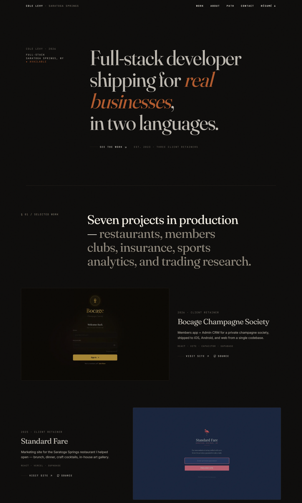

<div align="center">


# `<Cole Levy />` — Portfolio 2026

**Full-Stack Developer** · Saratoga Springs, NY

_A fast, animated, fully-responsive personal portfolio built from the ground up for 2026._

[](https://portfolio2026-seven.vercel.app)
[](https://colelevy08.github.io/Portfolio2026/)
[](https://react.dev)
[](https://www.typescriptlang.org)
[](https://tailwindcss.com)
[](https://vitejs.dev)
[](#license)

[**Live site**](https://portfolio2026-seven.vercel.app) ·
[**LinkedIn**](https://www.linkedin.com/in/colelevy) ·
[**GitHub**](https://github.com/colelevy08) ·
[**Email**](mailto:colelevy08@gmail.com)

</div>

---

<p align="center">
  <a href="https://portfolio2026-seven.vercel.app">
    
  </a>
</p>

---

## About

The 2026 rebuild of my personal portfolio — a complete re-imagining of [Portfolio25](https://github.com/colelevy08/Portfolio25) on a modern Vite + React + Tailwind stack.

Designed to be fast, accessible, and animated without feeling heavy — a single-page journey through who I am, what I've built, and how to reach me.

## Highlights

- **Single-viewport hero** — typographic editorial layout with staggered reveal
- **Tabbed Work section** — featured projects with gradient borders, live demos, and source links
- **About bento** — compact grid telling the story in a glance
- **Path timeline** — interactive career + education view
- **Formspree-powered contact** — validation and a real success state, no backend
- **Mobile-first** — verified at 375px and 1440px, keyboard-navigable
- **Tailwind v4** — CSS-first theming via `@theme`, no `tailwind.config.js`
- **Framer Motion** — section reveals only; no infinite loops, no parallax tax
- **Zero runtime CMS** — every word lives in typed TypeScript (`src/data/content.ts`)

## Tech stack

| Layer       | Tools                                                 |
| ----------- | ----------------------------------------------------- |
| Framework   | React 18 · TypeScript 5 · Vite 5                      |
| Styling     | Tailwind CSS 4 · custom CSS aurora / gradient borders |
| Animation   | Framer Motion                                         |
| Icons       | Lucide React                                          |
| Forms       | @formspree/react                                      |
| Deployment  | Vercel (primary) · GitHub Pages (mirror)              |

## Project structure

```
Portfolio2026/
├─ docs/
│  └─ preview.png        # README hero screenshot
├─ public/               # static assets (favicon)
├─ src/
│  ├─ assets/            # profile pic, resume PDF, project screenshots
│  ├─ components/        # Header, Hero, Work, About, Path, Contact, Footer
│  ├─ data/
│  │  └─ content.ts      # ALL portfolio content (profile, projects, history)
│  ├─ App.tsx            # section composition
│  ├─ main.tsx           # entry point
│  └─ index.css          # Tailwind + @theme tokens + aurora styles
├─ index.html
├─ vite.config.ts        # env-aware base path (Vercel vs gh-pages)
└─ tsconfig.json
```

## Getting started

**Requirements:** Node `20+`, npm.

```bash
git clone https://github.com/colelevy08/Portfolio2026.git
cd Portfolio2026
npm install
npm run dev        # http://localhost:5173/Portfolio2026/
```

### Build & preview

```bash
npm run build      # type-check + production bundle into dist/
npm run preview    # serve the built site locally
```

## Deployment

The site ships to **two targets** from the same `dist/` bundle. `vite.config.ts` flips the base path based on Vercel's `VERCEL` env var:

| Target           | URL                                                   | How                                          |
| ---------------- | ----------------------------------------------------- | -------------------------------------------- |
| **Vercel** (primary) | https://portfolio2026-seven.vercel.app                      | Auto-deploys on push to `main` (root path `/`)   |
| **GitHub Pages**     | https://colelevy08.github.io/Portfolio2026/           | `npm run deploy` (base `/Portfolio2026/`)        |

That's it — no Vercel config file, no GitHub Actions workflow. Framework detection on Vercel; `gh-pages` for the mirror.

## Customizing

All content — profile info, about paragraphs, skills, projects, history — lives in **`src/data/content.ts`**. Update it in one place and every section re-renders.

- **Theme colors:** `src/index.css` inside the `@theme {}` block
- **Contact form:** `profile.formspreeId` in `src/data/content.ts`
- **Resume PDF:** replace `src/assets/ColeLevyResume.pdf`

## Credits

- Built by **Cole Levy** — [colelevy08](https://github.com/colelevy08)
- Icons: [Lucide](https://lucide.dev)
- Fonts: [Inter](https://rsms.me/inter/), [JetBrains Mono](https://www.jetbrains.com/lp/mono/)

## License

MIT © Cole Levy

---

<div align="center">

_Designed, built, and caffeinated in Saratoga Springs, NY._

</div>
